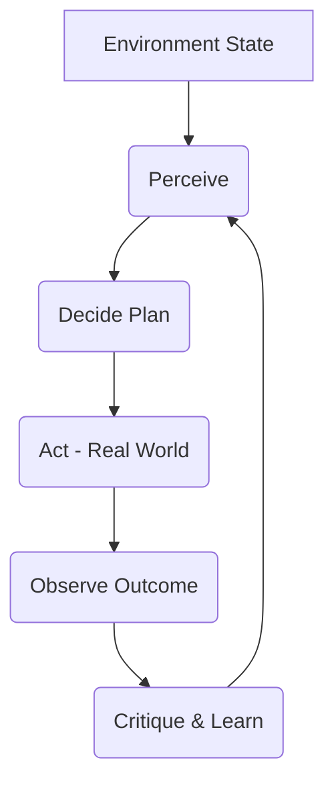

# Agent Lifecycle

| Step | Meaning |
|:--|:--|
| **Perceive** | Sense environment (input) |
| **Decide** | Think/plan what to do |
| **Act** | Do it (output) |
| **Learn** | Update internal model / memory |

## ✅ Environment State
- Load state from persistent store
- Make any metrics available to the agent
  
## ✅ Perceive
- Open the job board URLs.
- Detect links (even hidden or behind JS — Selenium helps here).
- Use Trafilatura to auto-detect page content if structure varies.
- Use BeautifulSoup if the page structure is known.

## ✅ Decide
- Prioritize scraping:
* Newer postings first.
* Companies you haven't scraped before.
* Ignore duplicates (check against self.memory).

## ✅ Act
- Scrape page.
- Send text content to OpenAI to summarize and extract details:
* Title
* Company
* Location
* Salary
* Remote/onsite
* Save or output the structured data.

## ✅ Learn
- If scraping fails:
* Retry once.
* If structure changed, fallback to Trafilatura full-content extraction.

- Update memory:
* Add scraped job URL IDs to prevent duplication.
* Optionally, retrain rules based on what works better.

| Feature | Just a Program | AI Agent |
|:---|:---|:---|
| **Goal-driven** | Executes fixed instructions | Has *own goals* and *chooses actions* to achieve them |
| **Adaptive behavior** | Follows pre-coded logic | Reacts and adapts based on new observations |
| **Planning ability** | Linear, no re-evaluation | Plans steps, can replan if needed |
| **Learning ability** | Only changes if reprogrammed | Modifies behavior based on past experience |
| **Autonomy** | Passive | Active decision-making without direct commands |
| **Reasoning or problem-solving** | Only what’s hardcoded | Dynamically reasons (even if shallow) about what to do next |

For teams, orgs, and executives, AI Agents unlock:

✅ Efficiency & Autonomy They run workflows end-to-end with minimal oversight: job monitoring, market scanning, data summarization — all on autopilot.

✅ Adaptability Agents aren’t brittle. If a site changes, they can switch tools, retry intelligently, or even ask an LLM how to adjust.

✅ Goal-Driven Execution You define what you want. The agent figures out how to get there — dynamically.